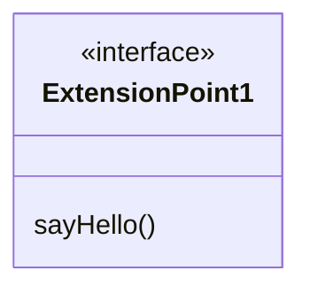

# example-plugin-api

[](https://github.com/flowscripter/example-plugin-api/releases)
[](https://github.com/flowscripter/example-plugin-api/actions/workflows/release-bun-library.yml)
[](https://flowscripter.github.io/example-plugin-api/index.html)
[](https://github.com/flowscripter/example-plugin-api/blob/main/LICENSE)

> Example plugin API for the
> [dynamic-plugin-framework](https://github.com/flowscripter/dynamic-plugin-framework)

## Bun Module Usage

Add the module:

`bun add @flowscripter/example-plugin-api`

Use the module:

```typescript
import {
  EXTENSION_POINT_1,
  ExtensionPoint1,
} from "@flowscripter/example-plugin-api";

// ExtensionPoint1 is identified by EXTENSION_POINT_1 identifier

class MyExtensionPointImplementation implements ExtensionPoint1 {
  public sayHello(): void {
    // greetings...
  }
}
```

## Development

Test:

`bun test`

**NOTE**: The following tasks use Deno as it excels at these and Bun does not
currently provide such functionality:

Format:

`deno fmt`

Lint:

`deno lint index.ts`

Generate HTML API Documentation:

`deno doc --html --name=example-plugin-api index.ts`

## Documentation

### Overview



### Framework API

Refer to the
[dynamic-plugin-framework](https://github.com/flowscripter/dynamic-plugin-framework)
for an overview of what this example is demonstrating.

### API

Link to auto-generated API docs:

[API Documentation](https://flowscripter.github.io/example-plugin-api/index.html)

## License

MIT © Flowscripter
