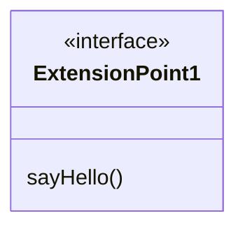

# example-plugin-api

[](https://github.com/flowscripter/example-plugin-api/releases)
[](https://github.com/flowscripter/example-plugin-api/actions/workflows/release-deno-library.yml)
[](https://codecov.io/gh/flowscripter/example-plugin-api)
[](https://jsr.io/@flowscripter/example-plugin-api/doc)
[](https://github.com/flowscripter/example-plugin-api/blob/main/LICENSE)

> Example plugin API for the
> [dynamic-plugin-framework](https://github.com/flowscripter/dynamic-plugin-framework).

## Deno Module Usage

```typescript
import {
  EXTENSION_POINT_1,
  ExtensionPoint1,
} from "@flowscripter/example-plugin-api";

// ExtensionPoint1 is identified by EXTENSION_POINT_1 identifier

class MyExtensionPointImplementation implements ExtensionPoint1 {
  public sayHello(): void {
    // greetings...
  }
}
```

## Development

Lint: `deno fmt`

## Documentation

### Overview


```mermaid
classDiagram
    
   class ExtensionPoint1 {
      <<interface>>
      sayHello()
   }
```

### Framework API

Refer to the
[dynamic-plugin-framework](https://github.com/flowscripter/dynamic-plugin-framework)
for an overview of what this example is demonstrating.

### API

Link to auto-generated API docs for the library:

[API Documentation](https://jsr.io/@flowscripter/example-plugin-api/doc)

## License

MIT © Flowscripter
